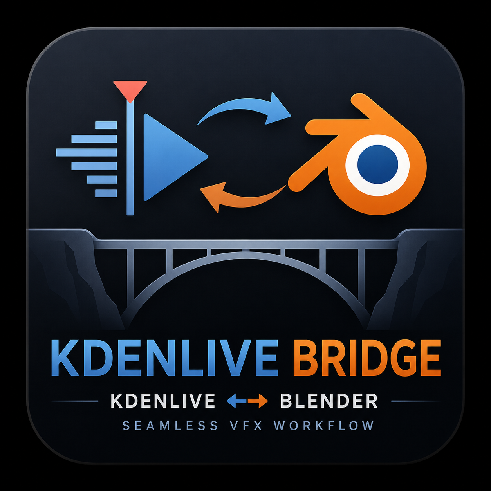

# Kdenlive-Bridge

  

Kdenlive Bridge

Round-trip VFX workflow between Kdenlive and Blender

Kdenlive Bridge is a Blender addon that connects Kdenlive and Blender into a single workflow.

Send a shot from Kdenlive, work on it in Blender, render the result, and sync it back to the timeline automatically.

The goal is to remove the manual export/import cycle typically required when using Blender for visual effects work inside a video editing pipeline.

---

Demo

  

Workflow

Kdenlive
    ↓
Send Shot
    ↓
Blender
    ↓
VFX / Compositing
    ↓
Render
    ↓
Sync
    ↓
Kdenlive Timeline Updated

---

Why?

Traditional Blender VFX workflows require:

1. Exporting a clip from the editor
2. Importing it into Blender
3. Configuring the project manually
4. Rendering the result
5. Replacing the clip back in the timeline

Kdenlive Bridge automates this round-trip process.

Instead of managing files manually, you can move shots between Kdenlive and Blender with a single workflow designed specifically for visual effects work.

---

Features

- Send shots from Kdenlive to Blender
- Automatic scene creation
- Automatic compositor setup
- Preview and final renders
- Automatic timeline replacement
- Project backup before every sync
- Shot validation and health checks
- Recovery from interrupted saves
- Recovery from corrupted project files
- Persistent shot metadata and render manifests
- No external dependencies

---

Compatibility

Software| Status
Blender 3.6| ✓ Supported
Blender 4.x| ✓ Supported
Kdenlive 24.x| ✓ Supported
Kdenlive 25.x| ✓ Supported

Supported Platforms

- Linux

Installation Methods

The addon is installation-independent and works with:

- Distribution packages (RPM, DEB, Pacman, etc.)
- Blender portable builds
- Kdenlive AppImage

---

Quick Start

1. Install the addon
2. Click Setup Kdenlive Integration
3. Send a shot from Kdenlive
4. Open the shot in Blender
5. Render Preview or Final
6. Click Sync → Kdenlive

Done.

---

Installation

Install the Addon

1. Download "kdenlive_bridge.zip" from Releases
2. Open Blender
3. Go to:

Edit → Preferences → Add-ons → Install...

4. Select the downloaded ZIP file
5. Enable Kdenlive Bridge

The addon appears in the Blender sidebar ("N" key) under the Kdenlive tab.

---

First-Time Setup

Open the Kdenlive panel and click:

Setup Kdenlive Integration

This installs the helper script used to send shots from Kdenlive to Blender.

---

Workflow

1. Send a Shot from Kdenlive

From Kdenlive:

Render → Scripts → send_to_blender.sh

or from a terminal:

send_to_blender /path/to/clip.mp4 0 240 25 /path/to/project.kdenlive

Arguments:

clip_path
frame_in
frame_out
fps
kdenlive_project

---

2. Open the Shot in Blender

When a shot is pending, the Kdenlive panel displays:

⚠ Pending Shot
[ Open Shot ]

Press Open Shot.

The addon automatically:

- Creates the Blender scene
- Imports the source clip
- Creates required collections
- Configures render paths
- Builds the compositor template
- Loads shot metadata

---

3. Work in Blender

Use Blender normally for:

- Camera tracking
- Matchmoving
- CGI integration
- Chroma keying
- Compositing
- Color work
- Visual effects

---

4. Render

Preview Render

Creates a fast review render at reduced resolution.

Used to quickly check the result inside Kdenlive.

Final Render

Available formats:

- ProRes 422
- H264
- EXR Sequence

Each render generates a validated render manifest before synchronization.

---

5. Sync Back to Kdenlive

Click:

Sync → Kdenlive

The addon:

1. Validates the render output
2. Creates a backup of the project
3. Updates the Kdenlive project file
4. Replaces the original shot with the rendered version

The shot remains in the same timeline position and duration.

---

Project Structure

project/
├── project.kdenlive
├── kdenlive_bridge_project.json
└── shots/
    ├── shot_001/
    │   ├── shot_metadata.json
    │   ├── render_manifest.json
    │   ├── source/
    │   ├── renders/
    │   ├── tracking/
    │   ├── comp/
    │   └── logs/
    └── ...

---

Validation and Recovery

Validate Shot

Use Validate Shot to verify:

- Source clip availability
- Metadata integrity
- Render manifest integrity
- Render output existence
- Project consistency

Automatic Recovery

The system automatically handles:

- Interrupted project saves
- Corrupted JSON metadata
- Corrupted ".kdenlive" XML files
- Missing render outputs
- Failed synchronization attempts

Whenever possible, backups are restored automatically.

---

Backups

Before every synchronization, the original Kdenlive project is preserved in:

.kdenlive_backups/

Example:

project_20260601_145233.kdenlive

If something goes wrong, replace the current project with a backup copy.

---

Logs

Global log:

~/.cache/kdenlive_bridge/bridge.log

Shot log:

shots/shot_001/logs/shot_001.log

Please include both logs when reporting bugs.

---

Known Limitations

Kdenlive Context Menu

Kdenlive does not currently provide an API that allows external addons to add actions directly to clip context menus.

Shots are sent using:

Render → Scripts

or the terminal helper.

---

Flatpak

When Kdenlive is installed via Flatpak, the helper script may not appear inside:

Render → Scripts

due to Flatpak sandbox restrictions.

The terminal workflow remains fully functional.

---

Tracking

The addon prepares the tracking workflow but does not perform automatic camera tracking.

Tracking markers must be placed manually in Blender.

---

Status

Alpha

The core workflow has been tested against:

- Standard Kdenlive projects
- Proxy workflows
- Offline clips
- Nested tractors
- Mixed frame-rate media
- Large shot collections
- Interrupted saves
- Corrupted metadata recovery
- Corrupted project recovery

Real-world testing and feedback are welcome.

---

Contributing

Bug reports, feature requests, pull requests, workflow feedback, and testing on different Linux distributions are appreciated.

When reporting issues, include:

- Blender version
- Kdenlive version
- Linux distribution
- Relevant logs
- Steps to reproduce

---

License

GPL-3.0
# Kdenlive-Bridge
